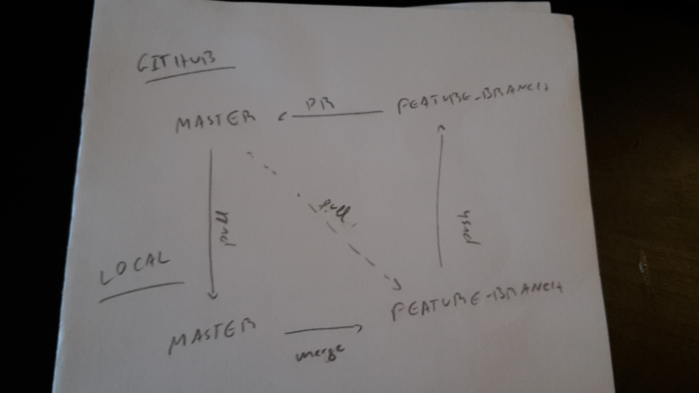

This is a review for HackYourFuture Git advanced. It has the following sections:

1. Github and remotes
2. Git branches
3. Pull requests
4. Our workflow in the class
5. Others
   - git stash
   - HEAD
   - git checkout
   - git reset
   - git revert
   - git cherry-pick


# 1. Github and remotes

## 1.1 What is remote ?

Before anything else, let's just clarify what is a remote.
If you're using Git collaboratively, you'll probably need to sync your commits with other machines or locations. In Git terminology, each machine or location is called a remote, and each one may have one or more branches. Most often, you'll have just one remote, named `origin`, which is a git repository in your own github account.

To list all the remotes, run
```
git remote
```

To see which locations these remote names are shortcuts for, run
```
 git remote -v
```


# 1.2 Adding a remote to your local repository

If you have not cloned an existing repository on github and want to connect your repository to a remote github repository, you need to add it with

```
git remote add origin https://github.com/marta_matos/my_first_repo.git
```

Replace the URL with the URL of the repository that you actually want to add.
Also, remember that `origin` is just a place holder, and the convention is to use `origin` for a repository that is in your own github account and `upstream` for a repository that is in someone else's github account (used in the forking worklow).

Now you are able to push your changes to the selected remote server i.e. your remote repository on GitHub.


## 1.3 Pushing, pulling, fetching changes to/from Github

To send any changes in a given branch on your local repository to your remote repository, go to that branch (`<branch_name>`) and execute

```
git push origin <branch_name>
```

However, this command will fail if there are changes in the remote repository that you do not have on your local machine. In that case you first need to get the changes from the remote repository to your local machine. To do so you do:

```
git pull origin <branch_name>
```

As a best practice, you should always do this before you push any changes into the remote repository.

If instead of getting the new changes from the remote repository into your local machine you just want to know if there are any changes, you can do

```
git fetch origin <branch_name>
```

Then if you do `git diff origin/<branch_name>` it will tell you any differences between your local `<branch_name>` and `origin/<branch_name>` (i.e. the `<branch_name>` branch on your github repository).
If you then want to incorporate those changes with your local `<branch_name>` you do:

```
git merge origin/<branch_name>
```

Doing `git fetch` followed by `git merge` is equivalent to doing `git pull`.

# Troubleshooting

You could encounter errors if you do not follow the exact procedure as described above.
```
error: failed to push some refs to 'git@github.com:myrepo.git'
```
Solution:
```
git pull origin <branch_name>
```

or

```
fatal: refusing to merge unrelated histories
```
Solution:
```
git pull --allow-unrelated-histories
```


# 2 Branches

## 2.1 Why Branches ?

To expand.
Trees need branches to expand.
Banks needs (office) branches to expand.
Company needs (code) branches to expand.
E.g. Branches for Bugs, testing, features, production, staging etc.


## 2.2 Types of Branches

On your local machine, you've got three types of branches:
 1. local branches : non-tracking
 2. local branches : tracking
 3. remote-tracking branches

On a remote machine, you have just one type of branch.

## Types of Branches (1) Branches on your machine:

### 2.2.1 Local branches

 To view a list of all the local branches on your machine, run
```
git branch
```

There are two types of local branches on your machine: non-tracking local branches, and tracking local branches.


#### 2.2.1.1 Non-tracking local branches

Non-tracking local branches are not associated with any other branch in the remote repository. To create one, run

```
git branch <branch_name>
```


####  2.2.1.2 Tracking local branches

Tracking local branches are associated with another branch on the remote repository, usually a remote-tracking branch. To convert an existing non-tracking local branch into a tracking local branch do:

```
git branch -u <remote>/<branch_name>
```

Where <remote> will typically be `origin`.

To view which one of your local branches are tracking branches, run

```
  $ git branch -vv
  master      b31f87c85 [origin/master] "my sample commit"
  new-feature b760e04ed "my branch is strong"
```

From this command's output, you can see that the local branch master is tracking the remote-tracking branch origin/master, and the local branch new-feature is not tracking anything.

"Tracking local branches" are useful. They allow you to run `git pull` and `git push` without specifying which branch to use. 


###  2.2.2 Remote-tracking branches (still on your machine)

To view a list of all the remote-tracking branches on your machine, run

```
git branch -a
```

Think of your remote-tracking branches as your local cache for what the remote machines contain. You can update your remote-tracking branches using `git fetch <remote> <branch_name>`, which `git pull` uses behind the scenes.
Even though all the data for a remote-tracking branch is stored locally on your machine (like a cache), it's still never called a local branch. (At least, I wouldn't call it that!). It's just called a remote-tracking branch.


##  2.3.3 Branches on a remote machine

To view all the remote branches (that is, the branches on the remote machine), run

```
    $ git remote show origin
    *remote origin
    Fetch URL: git@github.com:Flimm/example.git
    Push  URL: git@github.com:Flimm/example.git
    HEAD branch: master
    Remote branches:
    io-socket-ip            new (next fetch will store in remotes/origin)
    master                  tracked
    new-branch              tracked
    Local ref configured for 'git pull':
    master     merges with remote master
    new-branch merges with remote new-branch
    Local ref configured for 'git push':
    master     pushes to master     (up to date)
    new-branch pushes to new-branch (fast-forwardable)
```

This git remote command queries the remote machine over the network about its branches. It does not update the remote-tracking branches on your local machine, use `git fetch origin <branch_name>` or `git pull origin <branch_name>` for that.
From the output, you can see all the branches that exist on the remote machine by looking under the heading "Remote branches" (ignore lines marked as "stale").


# 3. Pull requests

Pull requests make it easier for developers to collaborate. They provide a user-friendly (web) interface for discussing proposed changes before integrating them into the official project.
In the simplest form, pull requests are a means for a developer to notify a team member that they have completed a feature. But the pull-request is more than just a notification. It's a dedicated forum where teammates can post feedback, push follow-up commits.
Even though it is named a pull request it is more like a merge request, where you ask for permission to merge a branch into another branch.


## What does a pull request contain:

When you create a pull request, you want another developer to pull a branch from your repository into their repository. This means that you need to provide 4 pieces of information to create a pull request:
* the source repository
* the source branch
* the destination repository
* the destination branch

Pull requests can be used in conjunction with various workflows:
* [Feature-branch workflow](https://www.atlassian.com/git/tutorials/comparing-workflows/feature-branch-workflow)
* [Gitflow workflow](https://www.atlassian.com/git/tutorials/comparing-workflows/gitflow-workflow)
* [Forking workflow](https://www.atlassian.com/git/tutorials/comparing-workflows/forking-workflow)


# 4. Our workflow in the class

 The workflow you learned in class was pretty much the Feature-branch workflow, and most workflows out there are based on this one.

 In this workflow you never commit directly to the master branch. The master branch should always be working, no errors there. Imagine your website is using the code on master to run, you don't want it to break :) 

 When you want to add a new feature, fix a bug, etc., you create a new branch and add your code there, and commit your changes as usual.
 Once you are done with your task, you check if there are any new commits on master, and if so you get them into your branch. To do this you:
  - go to master (`git checkout master`)
  - pull from master on github to update your local master (`git pull origin master`)
  - go back to your branch (`git checkout <branch_name>`)
  - merge the commits in your local master with your current branch (`git merge master`)

After your branch is up do date with master you can push it to github (`git push origin <branch_name>`), and then on github you create a Pull Request from your branch to `master`.

In your project, instead of `master` you'll probably have `develop` though.

This is a scheme of what it looks like:



(As a shortcut you can pull directly from the remote master to your branch, just make sure it works :) ) 

# 5. Others

## Git stash

Sometimes you try to move to a different branch and git won't let you because the changes you have made in your current branch will be overwritten.

In that case you have two options: to commit your changes or to stash them.

If you don't want to commit yet, because you didn't finish what you were doing for example, you can stash your changes by doing `git stash`. Then you can go to another branch.

When you want to get your changes back you can first do `git stash list` to see your list of "stashes", and then you select the stash that you want to get back by running:
 - `git stash pop stash@{<id>}` - this will get your changes back and delete them from the stash list.
 - `git stash apply stash@{<id>}` - this will get your changes back  without deleting them from the stash list.


## HEAD

The HEAD is basically a pointer that points to your latest commit in your current branch.


## Git checkout

The command `git checkout` is generally used to move somewhere in your repository:
 - to a branch: `git checkout <branch_name>`
 - to a specific commit: `git checkout <commit_hash>`

To find the hash of the commit you want to move to use `git log`.

However, when you move to a specific commit you get into a detached HEAD state, in this state you definitely should not do any commits. You should only look around, maybe run your code, and then go back to your latest commit using `git checkout <branch_name>`.

Going back to specific commit can be useful to check what our code looked like back then.


## Git reset

You use `git reset` when you want to get rid of commits.

There are three types of `git reset`:
 - `git reset --soft <commit_hash>` - will remove all commits until the commit with hash `<commit_hash>`, but the file changes will stay in the staging/index area.
 - `git reset --mixed <commit_hash>`- will remove all commits until the commit with hash `<commit_hash>`, but the file changes will stay in your filesystem.
 - `git reset --hard <commit_hash>`- will remove all commits until the commit with hash `<commit_hash>`, as well as the changes in your files. Be very careful with this one!


Bottom line: use the soft or mixed reset whenever you want, but think three times before using hard reset :)

## Git revert

You use `git revert <commit_hash>` when you want to revert what you did in a specific commit, with hash `<commit_hash>`.

This command will not remove any commits, instead it will create a new commit that undoes the selected commit (with hash `<commit_hash>`)


## Git cherry-pick

You use `git cherry-pick <commit_hash>` when you want to copy a commit from another branch to the branch where you are. 

To get the commit hash you should go to the branch where the commit has been made and do `git log`.

Then go to the branch where you want to "paste" the commit and do `git cherry-pick <commit_hash>`.